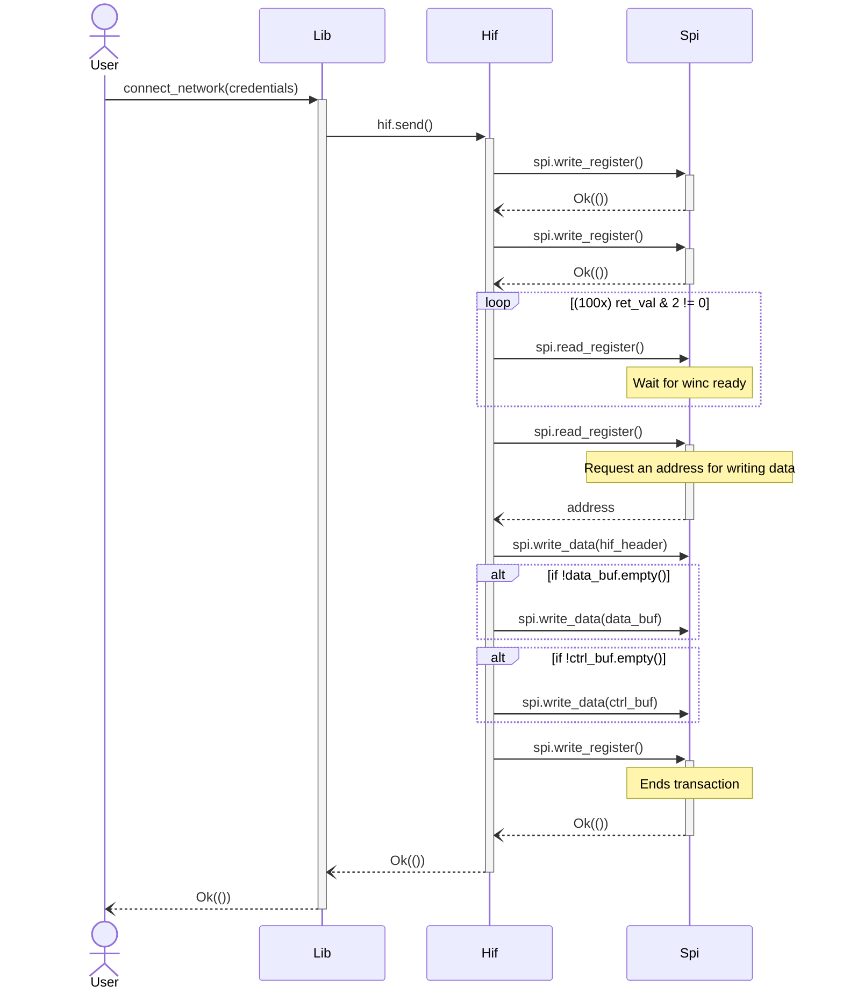

```mermaid
sequenceDiagram
    actor User
    participant Lib
    participant Hif
    participant Spi

    User ->>+ Lib: connect_network(credentials)
    Lib ->>+ Hif: hif.send()
    Hif ->>+ Spi: spi.write_register()
    Spi --)- Hif: Ok(())
    Hif ->>+ Spi: spi.write_register()
    Spi --)- Hif: Ok(())
    loop (100x) ret_val & 2 != 0
        Hif ->> Spi: spi.read_register()
        note over Spi: Wait for winc ready
    end
    Hif ->>+ Spi: spi.read_register()
    note over Spi: Request an address for writing data
    Spi --)- Hif: address
    Hif ->> Spi: spi.write_data(hif_header)
    alt if !data_buf.empty()
        Hif ->> Spi: spi.write_data(data_buf)
    end
    alt if !ctrl_buf.empty()
    Hif ->> Spi: spi.write_data(ctrl_buf)
    end
    Hif ->>+ Spi: spi.write_register()
    note over Spi: Ends transaction
    Spi --)- Hif: Ok(())
    Hif --)- Lib: Ok(())
    Lib --)- User: Ok(())
```
